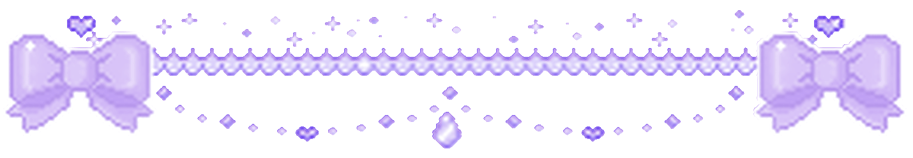
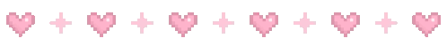
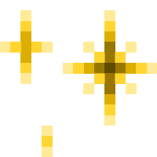
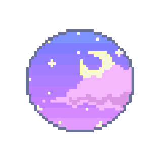
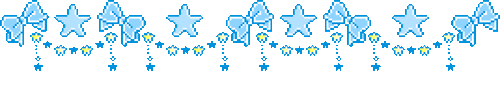

  <ul align="center" style="list-style: none;">
    

      <h1> welcome to my digital lair </h1>
    

    

      
    

  </ul>

    

    
&nbsp;&nbsp; i design systems that survive.  
&nbsp;&nbsp; professional pixel tamer.  
&nbsp;&nbsp; everything is throwaway until it's not  
  
  
> &nbsp;&nbsp; sometimes my code is haunted.  
> &nbsp;&nbsp; sometimes i am haunted by my code.

    

  
  <b>🎧 currently listening to:</b> <em><b>something slightly dramatic</b></em>
  <ul style="margin: 0; padding: 0;">
    <li>august burns red</li>
    <li>i prevail</li>
    <li>bring me the horizon</li>
    <li>linkin park 💖</li> 
  </ul>

   

<h2 align="center">🌙  about  </h2>

   
    
**likes:**
- iced matcha americanos  
- cats judging my code  
- subtle chaos with intent  
- icelandic water  

**known issues:**
- forgets to eat  
  
    
### 🐈‍⬛ coding companions
- pixel cats supervising commits [🔗](https://tonybaloney.github.io/vscode-pets/)  
- cozy cat themed text editors [🔗](https://catppuccin.com/)  
- a terminal window softly glowing [🔗](https://draculatheme.com/warp)  
- a forgotten glass of water always nearby  
- collection of slightly cursed components  

  

  

<h2 align="center"> current system state </h2>

 
  
| metric | status |
|--------|--------|
| code quality | doing her best |
| bugs | quivering in fear |
| caffeine | could have more |
| sleep | who is she? |
| emotional stability | [redacted] |
| days since last refactor | -1 |

focus      ▓▓▓▓▓▓▓▓░░  
creativity ▓▓▓▓▓▓▓▓▓░  
chaos      ▓▓▓░░░░░░░

  

  

<h2 align="center">📜 developer lore 📜</h2>

1997 — opened microsoft paint. became unstoppable.  
1998 — Comic Sans and gradients entered my life, chaos was born.  
2002 — discovered HTML. felt powerful.  
2003 — learned CSS, immediately made neon headings blink (don’t ask).  
2005 — animated GIF headers everywhere. did it really need to blink? yes.  
2008 — rewrote my homepage 3 times in one night, all pixel-perfect, all slightly cursed.  
2010 — wrote something that worked first try (still thinking about it).  
2014 — first JavaScript bug haunted me for a week.  
2016 — discovered dark mode. transcended.  
2020 — became one with the terminal.  
2022 — achieved enlightment via `git reset HEAD^`.  
2024 — shipped to production on a Friday.  
present — still shipping to production on Fridays.  
  
  

  

  
<h3>frequently avoided questions</h3>

  **what stack do you use?**  
  whatever feels emotionally aligned.
  
  **tabs or spaces?**  
  there's only 1 correct answer.
  
  **is this really you?**  
  debatable.

  

  
