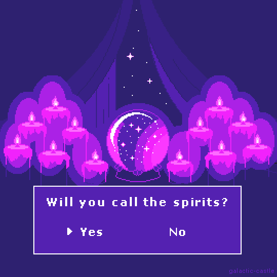
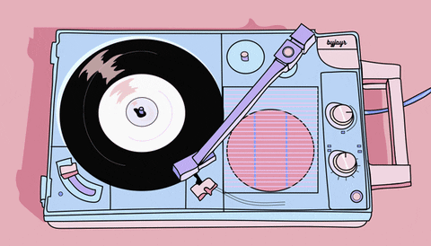
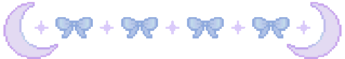

<h1 align="center">  welcome to my digital lair  </h1> 

  

  
i design systems that survive.  professional pixel tamer.  everything is throwaway until it's not.

  <blockquote>
    sometimes my code is haunted. 
    sometimes i am haunted by my code.
  </blockquote>

   

  
   
  <b>🎧 currently listening to:</b> <em><b>something slightly dramatic</b></em>
  <ul style="margin: 0; padding: 0;">
    <li>august burns red</li>
    <li>i prevail</li>
    <li>bring me the horizon</li>
    <li>linkin park 💖</li> 
  </ul>

  

  

   

## 🌙 about  
**likes:**  
- iced matcha americanos  
- cats judging my code  
- subtle chaos with intent  
- icelandic water   

**known issues:**  
- forgets to eat  
  
  
### 🐈‍⬛ coding companions
- pixel cats supervising commits [🔗](https://tonybaloney.github.io/vscode-pets/)  
- cozy cat themed text editors [🔗](https://catppuccin.com/)  
- a terminal window softly glowing [🔗](https://draculatheme.com/warp)  
- a forgotten glass of water always nearby  
- collection of slightly cursed components  

### 🍵 current system state

| metric | status |
|--------|--------|
| code quality | doing her best |
| bugs | quivering in fear |
| caffeine | could have more |
| sleep | who is she? |
| emotional stability | [redacted] |
| days since last refactor | -1 |

focus      ▓▓▓▓▓▓▓▓░░  
creativity ▓▓▓▓▓▓▓▓▓░  
chaos      ▓▓▓░░░░░░░
